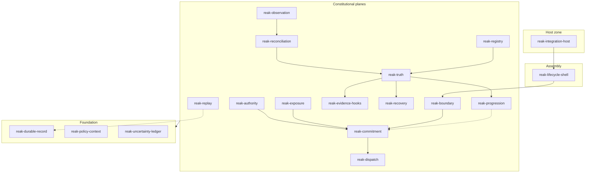

# Kernel module graph

See [KERNEL_MODULE_GRAPH.json](./KERNEL_MODULE_GRAPH.json) for machine-readable module list and seams.

## Layered view

Solid arrows: normative lifecycle. Dotted: read-only or conditional re-bind paths.

## Effect spine (non-negotiable)

Only `reak-dispatch` may request external effect execution. `reak-commitment` must precede every dispatch attempt on a lineage generation.

## Sense spine

`reak-observation` → `reak-reconciliation` → `reak-truth` must not be collapsed into a single module without re-admission (constitution Part 2 elimination test).

## Historical mapping (reference only)

| REAK module | Consequence II reference (not authoritative) |
|-------------|-----------------------------------------------|
| reak-observation | `canonical_observation_runtime` (ID-005) |
| reak-reconciliation | `canonical_reconciliation_runtime` (ID-006) |
| reak-truth | `canonical_truth_runtime` (ID-007) |
| reak-recovery | `canonical_recovery_runtime` (ID-008) |
| reak-progression | `canonical_safenext_runtime` (ID-009) |
| reak-commitment | R4 / ID-010 class |
| reak-dispatch | R5 / ID-011 class |

Naming change is intentional: greenfield programme, semantics admitted via MODULE_ADMISSION_REPORT.
