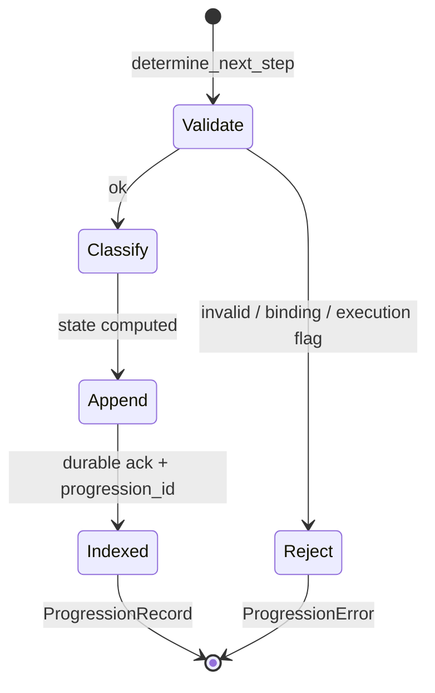

# Progression state machine

Classification is a **function** `(RecoveryStrategy, intent_authorized, TruthConclusion) → ProgressionState` after input validation. There is no internal progression engine state beyond the append-only log and indexes.

## Transition table

| Recovery strategy | `intent_authorized` | Truth (when relevant) | `ProgressionState` |
|-------------------|---------------------|-------------------------|--------------------|
| `Abort` | * | * | `Abort` |
| `Await` | * | * | `Await` |
| `NoAction` | * | `EstablishedSuccess` | `Terminal` |
| `NoAction` | * | other | `NoFurtherAction` |
| `Retry` | true | * | `RetryPermitted` |
| `Retry` | false | * | `Await` |
| `Compensate` | true | * | `CompensationPermitted` |
| `Compensate` | false | * | `Await` |
| `Escalate` | true | * | `HumanApprovalRequired` |
| `Escalate` | false | * | `Await` |

## Pre-conditions (reject before classify)

- Invalid or empty identifiers / zero policy hash → `InvalidInput`  
- Truth/recovery/authorization binding mismatch → `BindingMismatch`  
- `authorizes_execution == true` on recovery or authorization → `IllegalExecutionFlag`  
- Duplicate `recovery_id` or input digest → `DuplicateProgression`  

## Lifecycle (engine)

## Replay

`verify()` ensures hash chain integrity. `recover_from_log()` scans the PRG stream in order and rebuilds `by_recovery`, `by_digest`, and `by_id` — no reinterpretation of inputs.
